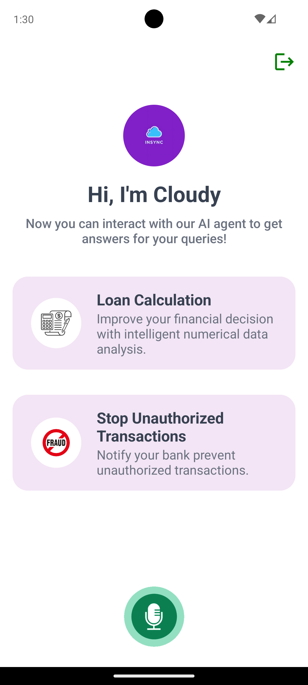

# InSync: AI-Powered Customer Support Streamlining Application

The InSync Mobile App UI Design project involves developing the front-end using React Native to improve customer satisfaction and transform customer support in the banking industry. The goal is to address issues such as lengthy wait times, repetitive processes, and ineffective communication in over-the-phone customer service. This front-end component was created as part of the Software Development Group Project for the second-year core module.

